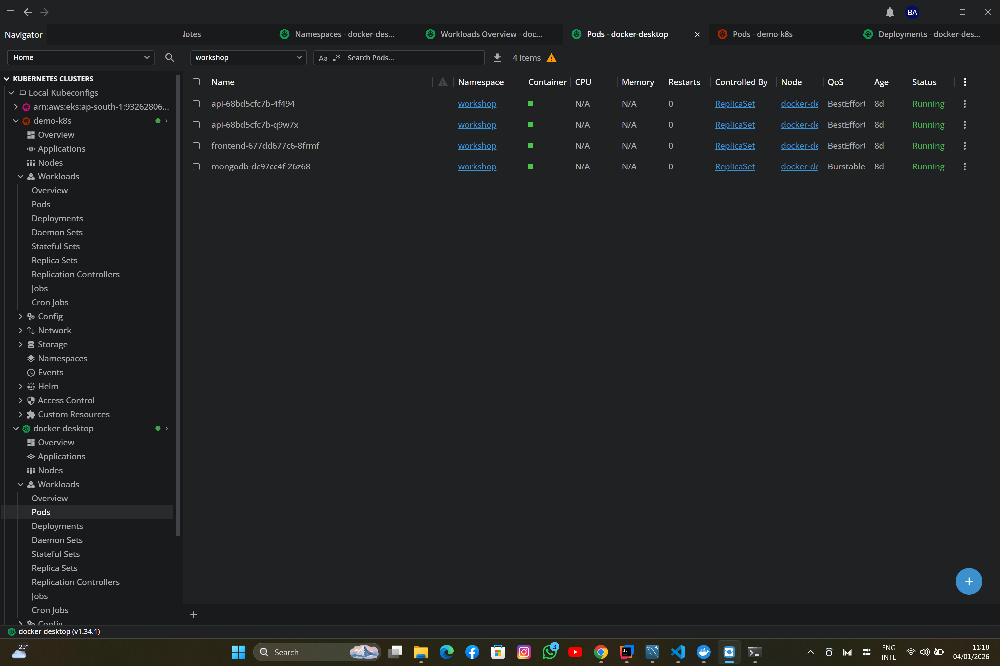
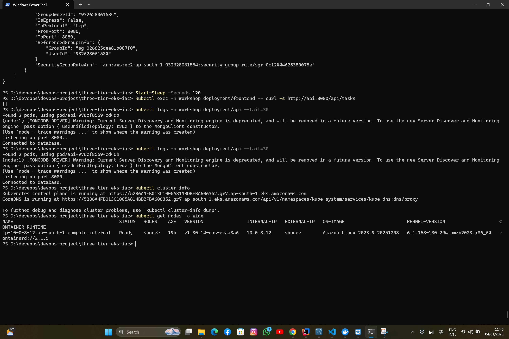
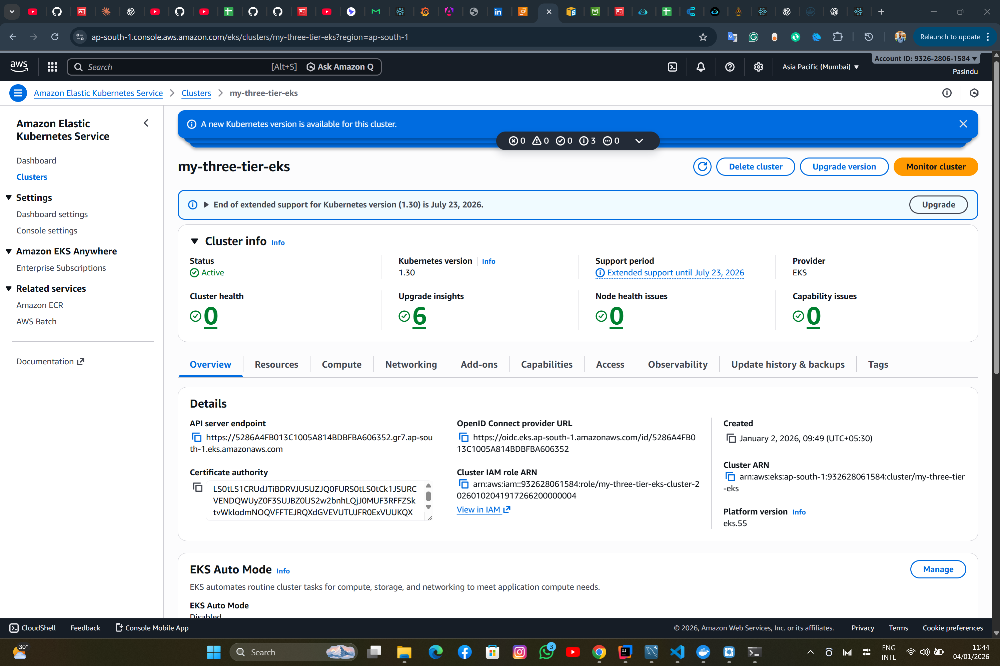

# Three-Tier Application Deployment on AWS EKS

[](https://kubernetes.io/)
[](https://aws.amazon.com/eks/)
[](https://www.terraform.io/)
[](https://www.docker.com/)

> Production-grade deployment of a three-tier React/Node.js/MongoDB application on AWS EKS using Terraform and Kubernetes.


## 🚀 Project Overview

Deployed a fully functional three-tier web application to AWS Elastic Kubernetes Service (EKS) with complete Infrastructure as Code (IaC) implementation using Terraform. The project demonstrates enterprise-level DevOps practices including containerization, orchestration, and cloud deployment.

### **Live Demo**
- **Status:** Deployed to AWS EKS (Mumbai Region)
- **Architecture:** Three-tier microservices
- **Infrastructure:** Fully automated with Terraform

## 🏗️ Architecture

```
Internet
    ↓
AWS Application Load Balancer
    ↓
┌─────────────────────────────────────────┐
│         AWS EKS Cluster                 │
│  ┌────────────┐  ┌──────────┐  ┌─────┐│
│  │  Frontend  │→ │ Backend  │→ │ DB  ││
│  │  (React)   │  │ (Node.js)│  │(Mongo)│
│  │  1 Pod     │  │  2 Pods  │  │1 Pod││
│  └────────────┘  └──────────┘  └─────┘│
└─────────────────────────────────────────┘
         AWS ap-south-1 (Mumbai)
```

## 💻 Technology Stack

### **Frontend**
- React.js with Material-UI
- Custom glassmorphism design
- Responsive web design
- Task management features (priority, due dates, search, filters)

### **Backend**
- Node.js with Express
- RESTful API architecture
- MongoDB integration
- Environment-based configuration

### **Database**
- MongoDB 4.4.6
- Persistent storage with AWS EBS
- Secure credential management with Kubernetes Secrets

### **Infrastructure**
- **Container Orchestration:** Kubernetes 1.30
- **Cloud Platform:** AWS EKS
- **Infrastructure as Code:** Terraform
- **Container Registry:** Docker Hub
- **Region:** Asia Pacific (Mumbai) - ap-south-1

### **DevOps Tools**
- Docker & Docker Compose
- kubectl
- Terraform
- AWS CLI
- Lens IDE (Kubernetes management)

## 📦 Application Features

- ✅ **Task Management:** Create, read, update, delete tasks
- ✅ **Priority Levels:** High, Medium, Low with color coding
- ✅ **Due Dates:** Task scheduling with date picker
- ✅ **Search & Filter:** Find tasks by title, description, status, or priority
- ✅ **Statistics Dashboard:** Real-time task analytics
- ✅ **Modern UI:** Glassmorphism design with smooth animations
- ✅ **Responsive Design:** Works on desktop and mobile

## 🎯 Key DevOps Implementations

### **1. Infrastructure as Code (Terraform)**
- Automated VPC creation with public/private subnets
- EKS cluster provisioning
- IAM roles and policies
- Security groups configuration
- AWS Load Balancer Controller
- Cluster Autoscaler

### **2. Container Orchestration (Kubernetes)**
- Multi-pod deployments with replica sets
- Service discovery and load balancing
- Rolling updates with zero downtime
- Self-healing infrastructure
- Horizontal pod autoscaling (HPA)
- Resource limits and requests

### **3. Security Best Practices**
- Kubernetes Secrets for sensitive data
- IAM roles for service accounts (IRSA)
- Private subnets for database
- Security group restrictions
- Non-root container users

### **4. High Availability**
- Multi-AZ deployment
- Load balancer health checks
- Pod replicas for redundancy
- Automatic pod restart on failure

### **5. CI/CD Ready**
- Containerized application
- Version-tagged Docker images
- Declarative Kubernetes manifests
- GitOps-friendly structure

## 📂 Project Structure

```
three-tier-eks-iac/
├── app/
│   ├── frontend/           # React application
│   │   ├── src/
│   │   ├── Dockerfile
│   │   └── package.json
│   └── backend/            # Node.js API
│       ├── models/
│       ├── routes/
│       ├── Dockerfile
│       └── index.js
├── k8s_manifests/          # Kubernetes YAML files
│   ├── mongo/
│   │   ├── secrets.yaml
│   │   ├── deploy.yaml
│   │   └── service.yaml
│   ├── backend-deployment.yaml
│   ├── backend-service.yaml
│   ├── frontend-deployment.yaml
│   ├── frontend-service.yaml
│   └── ingress-no-domain.yaml
└── terraform/              # Infrastructure as Code
    ├── eks.tf
    ├── vpc.tf
    ├── iam.tf
    ├── autoscaler-iam.tf
    ├── helm-load-balancer-controller.tf
    ├── monitoring.tf
    ├── variables.tf
    └── provider.tf
```

## 🚀 Deployment Process

### **Prerequisites**
- AWS Account with appropriate permissions
- Terraform >= 1.0
- kubectl >= 1.30
- Docker Desktop
- AWS CLI configured

### **Step 1: Clone Repository**
```bash
git clone https://github.com/YOUR_USERNAME/three-tier-eks-deployment.git
cd three-tier-eks-deployment
```

### **Step 2: Configure AWS Credentials**
```bash
aws configure
# Set region: ap-south-1 (or your preferred region)
```

### **Step 3: Build and Push Docker Images**
```bash
# Build images
docker build -t pasindumalinga/frontend-app-host:v1 ./app/frontend
docker build -t pasindumalinga/backend-app-host:v1 ./app/backend

# Push to Docker Hub
docker push pasindumalinga/frontend-app-host:v1
docker push pasindumalinga/backend-app-host:v1
```

### **Step 4: Update Kubernetes Manifests**
Update image references in:
- `k8s_manifests/frontend-deployment.yaml`
- `k8s_manifests/backend-deployment.yaml`

### **Step 5: Deploy Infrastructure with Terraform**
```bash
cd terraform

# Initialize Terraform
terraform init

# Review planned changes
terraform plan

# Deploy infrastructure
terraform apply
```

⏱️ **Deployment time:** ~15-20 minutes

### **Step 6: Configure kubectl**
```bash
aws eks update-kubeconfig --region ap-south-1 --name my-three-tier-eks
```

### **Step 7: Deploy Application**
```bash
# Create namespace
kubectl create namespace workshop

# Deploy MongoDB
kubectl apply -f k8s_manifests/mongo/secrets.yaml
kubectl apply -f k8s_manifests/mongo/deploy.yaml
kubectl apply -f k8s_manifests/mongo/service.yaml

# Deploy Backend
kubectl apply -f k8s_manifests/backend-deployment.yaml
kubectl apply -f k8s_manifests/backend-service.yaml

# Deploy Frontend
kubectl apply -f k8s_manifests/frontend-deployment.yaml
kubectl apply -f k8s_manifests/frontend-service.yaml

# Create Ingress
kubectl apply -f k8s_manifests/ingress-no-domain.yaml
```

### **Step 8: Access Application**
```bash
# Get Load Balancer URL
kubectl get ingress -n workshop

# Access application at the provided URL
```

## 📊 Kubernetes Resources

### **Deployments**
| Component | Replicas | Image | Resources |
|-----------|----------|-------|-----------|
| Frontend | 1 | pasindumalinga/frontend-app-host:v1 | 256Mi RAM, 250m CPU |
| Backend | 2 | pasindumalinga/backend-app-host:v1 | 512Mi RAM, 500m CPU |
| MongoDB | 1 | mongo:4.4.6 | 1Gi RAM, 500m CPU |

### **Services**
| Service | Type | Port | Target |
|---------|------|------|--------|
| frontend | ClusterIP | 3000 | Frontend Pods |
| api | ClusterIP | 8080 | Backend Pods |
| mongodb-svc | ClusterIP | 27017 | MongoDB Pod |
| mainlb | Ingress | 80 | Frontend/Backend |

### **AWS Resources Created**
- ✅ EKS Cluster (Kubernetes 1.30)
- ✅ VPC with public/private subnets
- ✅ NAT Gateway
- ✅ Internet Gateway
- ✅ EC2 Worker Nodes (t3.small)
- ✅ Application Load Balancer
- ✅ EBS Volumes for persistent storage
- ✅ IAM Roles and Policies
- ✅ Security Groups

## 🔧 Management Commands

### **Scaling**
```bash
# Scale backend horizontally
kubectl scale deployment api -n workshop --replicas=5

# View pod distribution
kubectl get pods -n workshop -o wide
```

### **Updates (Rolling Deployment)**
```bash
# Update to new image version
kubectl set image deployment/frontend -n workshop frontend=pasindumalinga/frontend-app-host:v2

# Watch rolling update
kubectl rollout status deployment/frontend -n workshop
```

### **Monitoring**
```bash
# Check pod status
kubectl get pods -n workshop

# View logs
kubectl logs -n workshop deployment/frontend
kubectl logs -n workshop deployment/api

# Describe resources
kubectl describe deployment frontend -n workshop
```

### **Debugging**
```bash
# Get into pod shell
kubectl exec -it -n workshop deployment/frontend -- /bin/sh

# Test internal connectivity
kubectl exec -n workshop deployment/frontend -- curl http://api:8080/api/tasks
```

## 💰 Cost Optimization

### **Current Infrastructure Costs (ap-south-1)**
- EKS Control Plane: ~$72/month
- t3.small Worker Node: ~$15/month
- Application Load Balancer: ~$18/month
- EBS Storage: ~$1/month
- **Total: ~$106/month**

### **Cost Saving Strategies**
1. **Spot Instances:** Can reduce node costs by 70%
2. **Cluster Autoscaler:** Scale down during low usage
3. **Right-sizing:** Monitor and adjust instance types
4. **Scheduled Scaling:** Scale to zero during non-business hours
5. **Destroy when not in use:** `terraform destroy` (redeploy in 15 minutes)

## 🔒 Security Considerations

- ✅ Kubernetes Secrets for credentials (base64 encoded)
- ✅ IAM roles with least privilege access
- ✅ Private subnets for database
- ✅ Security groups restricting traffic
- ✅ Non-root containers
- ✅ Network policies (can be enabled)
- ⚠️ Consider: AWS Secrets Manager for production
- ⚠️ Consider: Certificate Manager for HTTPS

## 📈 Future Enhancements

- [ ] Implement CI/CD pipeline (GitHub Actions / Jenkins)
- [ ] Add HTTPS with AWS Certificate Manager
- [ ] Integrate Prometheus + Grafana monitoring
- [ ] Implement horizontal pod autoscaling (HPA)
- [ ] Add Redis for caching
- [ ] Implement blue-green deployments
- [ ] Add health checks and liveness probes
- [ ] Implement backup strategy for MongoDB
- [ ] Add custom domain with Route 53
- [ ] Implement network policies

## 🎓 Learning Outcomes

Through this project, I gained hands-on experience with:

✅ **Kubernetes:** Pod orchestration, Services, Deployments, Ingress  
✅ **AWS Services:** EKS, EC2, VPC, ALB, IAM, EBS  
✅ **Infrastructure as Code:** Terraform for full automation  
✅ **Containerization:** Docker multi-stage builds, image optimization  
✅ **DevOps Practices:** Rolling updates, zero-downtime deployments  
✅ **Cloud Architecture:** Multi-tier application design  
✅ **Troubleshooting:** Log analysis, debugging in production  
✅ **Security:** IAM, Secrets management, network policies  
✅ **Monitoring:** Resource utilization, health checks  

## 🛠️ Troubleshooting

### **Common Issues**

**1. Pods in ImagePullBackOff:**
```bash
# Check if images are accessible
docker pull pasindumalinga/frontend-app-host:v1

# Verify image name in deployment
kubectl describe pod -n workshop <pod-name>
```

**2. Load Balancer Unhealthy Targets:**
```bash
# Check security group rules
# Ensure ALB can reach pods on required ports

# Check pod health
kubectl get pods -n workshop
kubectl logs -n workshop <pod-name>
```

**3. Terraform Apply Fails:**
```bash
# Check AWS credentials
aws sts get-caller-identity

# Verify IAM permissions
# Ensure service-linked roles exist
```

## 📸 Screenshots

### Application Running on AWS


### Kubernetes Resources


### EKS Cluster


### AWS Console


## 🧹 Cleanup

To avoid AWS charges, destroy all resources:

```bash
cd terraform
terraform destroy
```

Type `yes` to confirm. All resources will be deleted in ~10 minutes.

## 📄 License

This project is open source and available under the [MIT License](LICENSE).

## 👤 Author

**Pasindu Malinga**

- GitHub: [@pasindumalinga](https://github.com/pasiya2021)
- Docker Hub: [@pasindumalinga](https://hub.docker.com/u/pasindumalinga)
- LinkedIn: [LinkedIn Profile](https://www.linkedin.com/in/pasindu-bandara-4b8b68368/)

## 🙏 Acknowledgments

- Original repository structure inspired by community best practices
- AWS EKS documentation
- Kubernetes community guides
- Terraform AWS modules

## 📚 References

- [Kubernetes Documentation](https://kubernetes.io/docs/)
- [AWS EKS Best Practices](https://aws.github.io/aws-eks-best-practices/)
- [Terraform AWS Provider](https://registry.terraform.io/providers/hashicorp/aws/latest/docs)
- [Docker Documentation](https://docs.docker.com/)

---

⭐ If you found this project helpful, please give it a star!

🐛 Found a bug or have a suggestion? Open an issue!

🤝 Contributions are welcome! Fork the repo and submit a pull request.
